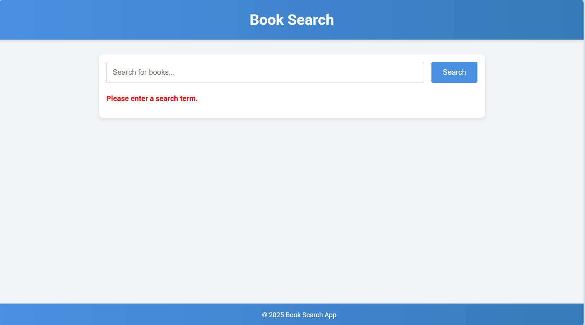
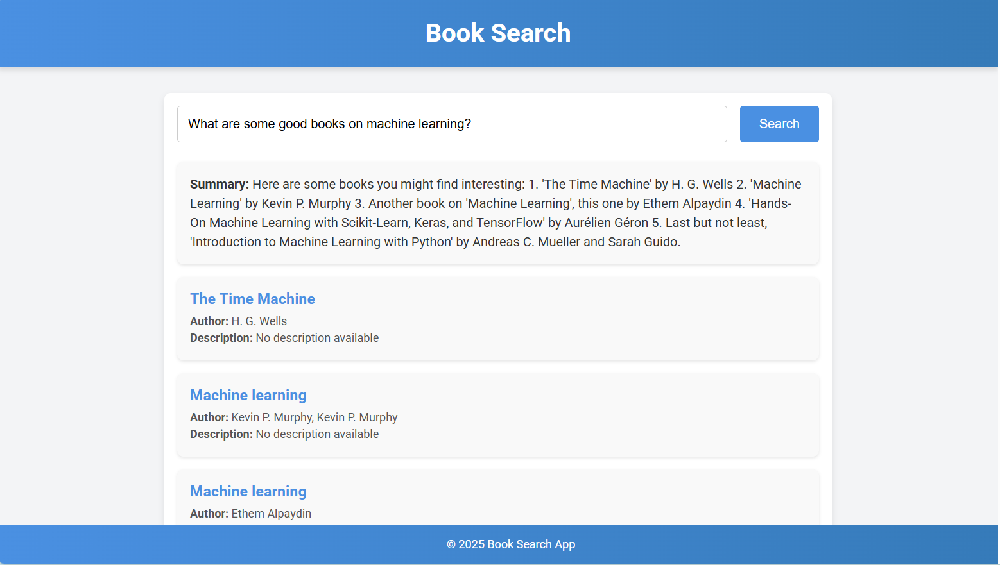

# Book Search App

## Overview

The **Book Search App** is a web application that allows users to search for books using natural language queries. The app integrates with OpenAI's GPT models and the OpenLibrary API to provide book recommendations with titles, authors, and descriptions. It also integrates with Power Automate for workflow automation.

---

## Features

- **Natural Language Search**: Users can input queries in natural language.
- **Book Recommendations**: Displays a list of books with titles, authors, and descriptions.
- **Error Handling**: Provides meaningful error messages for invalid queries or API failures.
- **Responsive Design**: Works on both desktop and mobile devices.
- **Profanity Filtering**: Rejects queries containing profanity.
- **Power Automate Integration**: Automates workflows by sending query and recommendation data to Power Automate.

---

## Technologies Used

### Frontend

- React
- CSS

### Backend

- Flask
- OpenAI API
- OpenLibrary API
- Python

### Azure

- Power Automate

---

## Setup Instructions

### Prerequisites

- Node.js and npm
- Python 3.x
- OpenAI API Key
- Power Automate Flow URL
- OpenLibrary API URL (optional)

### Backend Setup

1. Navigate to the `backend` folder:
   ```bash
   cd backend
   ```
2. Install the required Python dependencies:
   pip install -r requirements.txt
3. Create a .env file in the backend folder and add the following environment variables:
   OPENAI_API_KEY=<your_openai_api_key>
   OPENLIBRARY_URL=http://openlibrary.org/search.json
   POWER_AUTOMATE_FLOW_URL=https://prod-131.westus.logic.azure.com:443/workflows/335256929f874a69bd19348d5afc4b67/triggers/manual/paths/invoke?api-version=2016-06-01&sp=%2Ftriggers%2Fmanual%2Frun&sv=1.0&sig=foLzu1UsIi1rGhiEiReuYuqB6mn13RkbV2CYwcJAJVk

4.Run the backend server:

```bash
python app.py

## Frontend Setup
1.Navigate to the frontend folder:
   cd frontend
2.Install the required npm dependencies
   npm install
3.Start the development server:
   npm start

--------------------------------------------------------
## Testing Instructions

# Backend Testing

1.Use a tool like Postman or cURL to test the /search-books endpoint.
2.Example request
   POST /search-books
   Content-Type: application/json

   {
      "query": "Books on AI"
   }
3.Verify the response includes a list of books and a summary.

## Frontend Testing

1.Open the app in your browser.
2.Enter a query in the search bar and verify that the results are displayed correctly.
3.Test edge cases such as:
   a.Empty input
   b.Profanity
   c.Non-book-related queries

## Deployment Instructions

# Azure Deployment
1.Deploy the backend to Azure App Service:
   Create an Azure App Service instance.
   Deploy the Flask app using the Azure CLI or Azure Portal.
2.Deploy the frontend to Azure Static Web Apps:
   Create an Azure Static Web App instance.
   Connect your GitHub repository for automatic deployment.

## Screenshots
Search Page

Results Page


## Power Automate Integration

The app integrates with Power Automate to automate workflows. When a user submits a query, the backend sends the query, processed query, summary, and book recommendations to a Power Automate Flow.

# Setting Up the Power Automate Flow

1.Create a new flow in Power Automate with an HTTP trigger.
2.Configure the flow to accept the following JSON payload:
   {
    "query": "Books on AI",
    "processed_query": "Artificial Intelligence",
    "summary": "Here are some books you might enjoy...",
    "books": [
        {
            "title": "Book Title",
            "author": "Book Author",
            "description": "Book Description"
        }
    ]
}

3.Add actions to process the data (e.g., store it in a Google Sheet an send an email when a query is processed).
```
